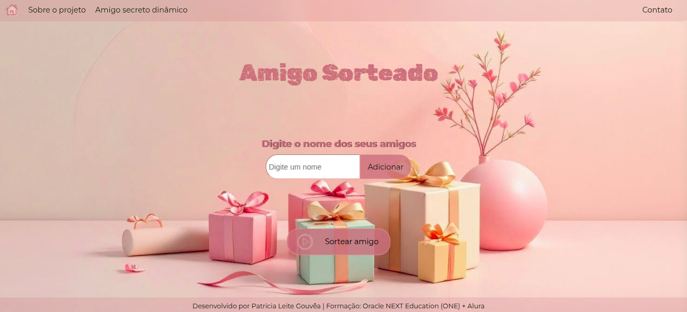
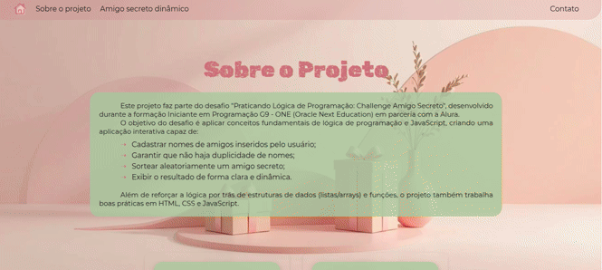
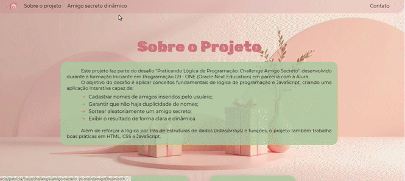

# Amigo Secreto JS
<p align="center">
  <a href="https://patriciagouvea.github.io/challenge-amigo-secreto/" target="_blank">
    🔗 Teste o projeto online
  </a>
</p>

<p align="center">
  
</p>

<p align="center">
  
  
  
  
  
</p>

## 📌 Descrição
Este projeto é um desafio de **Lógica de Programação** realizado durante a formação **Iniciante em Programação G9 - Oracle Next Education (ONE) + Alura**.  
Ele consiste em uma aplicação web interativa que permite **cadastrar participantes** e **sortear amigos secretos** de forma simples ou dinâmica.

O projeto reforça conceitos fundamentais de **JavaScript**, como:
- Variáveis
- Condicionais
- Funções
- Arrays
- Loops de repetição  

Além disso, aplica boas práticas em **HTML e CSS** para criar uma interface agradável e funcional.

---

## 🎮 Funcionalidades

### Amigo Sorteado
- Adicionar nomes de participantes sem duplicidade.
- Sortear um participante aleatoriamente.
- Exibir o resultado imediatamente na tela.

### Amigo Secreto Dinâmico
- Adicionar nomes de participantes sem duplicidade.
- Nenhum participante pode se sortear.
- Ninguém sabe quem tirou quem até clicar no próprio botão.
- Botões desaparecem com animação após revelar o amigo secreto.

### Contato e Sobre o Projeto
- Links para **LinkedIn** e **GitHub** do desenvolvedor.
- Explicação detalhada sobre o funcionamento do projeto e sua lógica.

---

## 🛠️ Tecnologias Utilizadas
- HTML5: estrutura das páginas
- CSS3: estilização e layout
- JavaScript (ES6+): lógica do sorteio e interatividade  
- Google Fonts: Montserrat e Rubik Distressed  
- Icons8: Gerador dos ícones
- Nightcafe: Gerador background 
---

## 🧩 Como Executar

1. Clone o repositório:
```bash
git clone https://github.com/PatriciaGouvea/AmigoSecretoJS.git
```
2. Navegue até a pasta do projeto:
```bash
cd AmigoSecretoJS
```
3. Abra o arquivo index.html em seu navegador preferido.
```bash
Observação: Não é necessário servidor local. O projeto roda diretamente no navegador.
```
## 📂 Estrutura do Projeto
```bash
AmigoSecretoJS/
├─ assets/             # Imagens, ícones e fundos
├─ index.html          # Página do Amigo Sorteado
├─ about.html          # Página "Sobre o Projeto"
├─ amigoDinamico.html  # Página do Amigo Secreto Dinâmico
├─ contato.html        # Página de Contato
├─ style.css           # Estilo global
├─ app.js              # JS do Amigo Sorteado
└─ appDinamico.js      # JS do Amigo Secreto Dinâmico
```
## 🎥 Demonstração

- Amigo Sorteado: captura rápida e simples do sorteio.
<p align="center">
  
</p>

- Amigo Secreto Dinâmico: sorteio seguro, com animações e sigilo.
<p align="center">
  
</p>


## 📜 Licença

Este projeto está sob a licença MIT.

## 📬 Contato

- [LinkedIn](https://www.linkedin.com/in/patricialgouvea)  
- [GitHub](https://github.com/PatriciaGouvea)
---
<p align="center">
  👩‍💻 Desenvolvido por <strong>Patricia Leite Gouvêa</strong>
    <br>
  Formação: Oracle NEXT Education (ONE) + Alura
</p>

